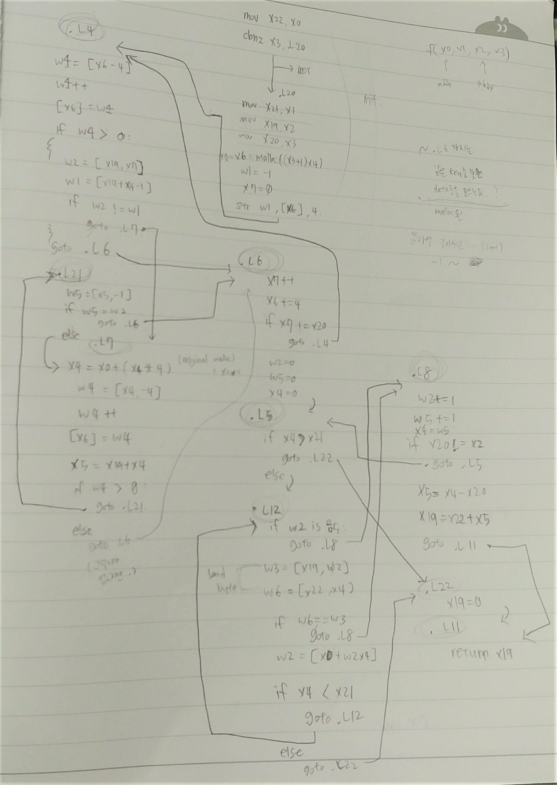

## code
```arm
f2:
        stp     x29, x30, [sp, -48]!
        add     x29, sp, 0
        stp     x21, x22, [sp, 32]
        stp     x19, x20, [sp, 16]
        mov     x22, x0

        cbnz    x3, .L20
        
        ldp     x19, x20, [sp, 16]
        ldp     x21, x22, [sp, 32]
        ldp     x29, x30, [sp], 48
        ret
.L20:
        add     x0, x3, 1
        mov     x21, x1
        lsl     x0, x0, 2
        mov     x19, x2
        mov     x20, x3

        bl      malloc
        
        mov     x6, x0  ; allocated addr
        mov     w1, -1
        mov     x7, 0   ; counter
        str     w1, [x6], 4     ; store and x6 += 4
.L4:    ; store 
        ldr     w4, [x6, -4]
        add     w4, w4, 1
        str     w4, [x6]    ; store +1'd value of privious value
        cmp     w4, wzr
        ble     .L6         ; less or equal to zero
        sxtw    x4, w4      ; signed extension
        ldrb    w2, [x19, x7]   ; arg3[counter]
        add     x1, x19, x4     ; 
        ldrb    w1, [x1, -1]
        cmp     w1, w2
        bne     .L7
        b       .L6
.L21:
        ldrb    w5, [x5, -1]
        cmp     w5, w2
        beq     .L6
.L7:
        add     x4, x0, x4, lsl 2
        ldr     w4, [x4, -4]
        add     w4, w4, 1
        str     w4, [x6]
        cmp     w4, wzr
        sxtw    x4, w4
        add     x5, x19, x4
        bgt     .L21
.L6:
        add     x7, x7, 1
        add     x6, x6, 4
        cmp     x7, x20
        bne     .L4
        mov     w2, 0
        mov     w5, 0
        mov     x4, 0
.L5:
        cmp     x4, x21
        bcs     .L22
.L12:
        tbnz    w2, #31, .L8    ; is sign bit not zero? (is it neg. int?)
        ldrb    w3, [x19, w2, sxtw]
        ldrb    w6, [x22, x4]
        cmp     w6, w3
        beq     .L8
        cmp     x4, x21
        ldr     w2, [x0, w2, sxtw 2]
        bcc     .L12
.L22:
        mov     x19, 0
.L11:
        bl      free
        mov     x0, x19
        ldp     x19, x20, [sp, 16]
        ldp     x21, x22, [sp, 32]
        ldp     x29, x30, [sp], 48
        ret
.L8:
        add     w2, w2, 1
        add     w5, w5, 1
        cmp     x20, x2, sxtw
        sxtw    x4, w5
        bne     .L5
        sub     x5, x4, x20
        add     x19, x22, x5
        b       .L11    ; return
```

## description

TBNZ
- test bit and branch

Wow.. is this code obfuscated?

or the compiler really returns like this?

I can't find the condition that this function won't return zero.

### 1. in `.L4`, `L21`, `L7`, `L6`

initializes the allocated array

it finds the char index where it matches with the first character in `arg3` string.
- can assume that it is a string, and `arg4` is a string length.

### 2. in `L5`, `L12`, `L8`, `L22`, `L11`

Here comes the weird part!

I wish that I'm wrong... It's so weird!

let's say 

```c
char* f2(char* s1, int len1, char* s2, int len2);
```

then, the string `s1` should be `s2`'s first character * times the character has appeared in it.

for example
```c
char s[] = "aaaaaaaaaa"; // 10 'a's
char buf[] = "aaabbbaaacccaaadda" // there are 10 'a's in this string
```

and returns weird thing. well, can't be sure what it is, 

but, it seems that it returns the `s1` and `s2`'s address distance plus "starting char." 's number that it appeared in s2.

Wow.. such an uncomfortable ananlyse result here..

I need feedback! T^T


